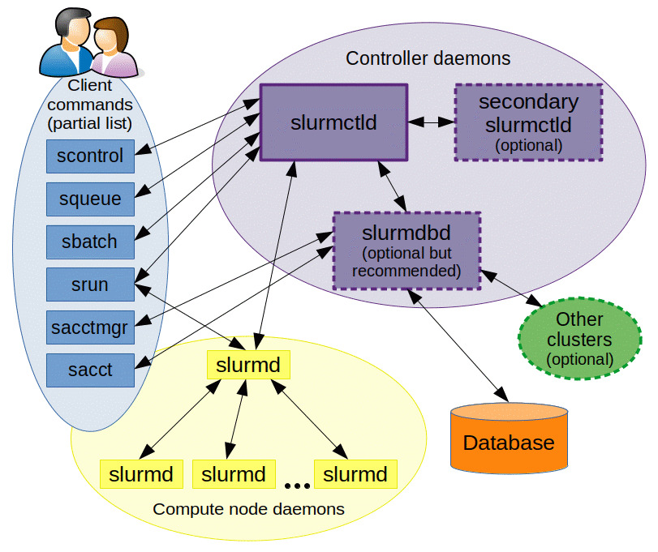

# Slurm

## What is an HPC Cluster?

Before we talk about Slurm, we have to talk about High-Performance Computing (HPC) Clusters. Imagine you have a massively complex math problem, like simulating the weather or training an AI. A standard laptop would take years to solve it. Instead, scientists use an HPC Cluster. A cluster is not one giant computer; it is hundreds or thousands of individual, highly powerful computers (called nodes) wired together to act as one massive supercomputer. Each of these nodes contains valuable resources:

- CPUs (the brains for general tasks)
- GPUs (specialized chips for AI and heavy math)
- Memory (short-term data storage)

## The Need for a "Traffic Cop"

Imagine a busy university where 500 different scientists all want to run massive simulations on the HPC cluster at the exact same time. If they all just tried to run their programs simultaneously, the computers would crash. Some scientists need 10 nodes for an hour; others need 1 node with 4 GPUs for three days. To keep the system fair, highly utilized, and organized, the cluster needs a "traffic cop" or a restaurant host. In the computing world, this traffic cop is called a Workload Manager (or Job Scheduler).

[Slurm](https://slurm.schedmd.com/) is exactly that traffic cop. It is a highly popular, open-source workload manager built specifically for these massive HPC clusters. It originally stood for "Simple Linux Utility for Resource Management". However, over time, it became so advanced that it is no longer just a "simple utility". Today, the acronym is mostly ignored, and it is simply treated as a name: Slurm.

## How Slurm Works

At its core, Slurm is brilliant because it separates two distinct jobs:

- **Resource Allocation** (The Planning): Slurm looks at all the incoming requests (called jobs) and looks at the available computers in the cluster. Based on policies, user priorities, and availability, it decides who gets which computers, and when.

- **Job Execution** (The Doing): Once the resources are allocated, Slurm dispatches the job to those specific nodes and gets the program running.

By separating these two steps, Slurm ensures that the cluster is constantly busy (high utilization) but no single user hogs all the power (fairness). Modern Slurm is incredibly powerful. Beyond just putting jobs in a queue, it handles complex tasks:

- **Heterogeneous Scheduling**: It can mix-and-match resources precisely. (e.g., "Give this job 2 CPUs and 3 GPUs on a specific type of node.")
- **Job Dependencies**: You can tell Slurm, "Do not start Job B until Job A has successfully finished."
- **Accounting**: It tracks exactly who used what resources and for how long, which is crucial for billing and budgets.
- **Massive Scalability**: It can smoothly manage clusters containing many thousands of nodes.

## Who Uses Slurm?

Because Slurm is so powerful and scalable, Slurm is the industry standard for high-level computing. You will find it running at:

- Universities & Research: MIT, Stanford, and CERN (the particle physics lab).
- Supercomputing Centers: Many of the world's fastest supercomputers on the famous "Top500" list run on Slurm.
- Government Labs: NASA, and Department of Energy labs like Oak Ridge and Argonne.
- Enterprise AI/ML: Massive tech companies like NVIDIA, or pharmaceutical companies running huge drug discovery simulations.

## Slurm Ownership and Ecosystem

In December 2025, NVIDIA acquired SchedMD, the primary developer and commercial support provider of Slurm. The acquisition was announced on December 15, 2025, as part of NVIDIA’s broader strategy to strengthen its software stack for HPC and AI workloads.

The motivation behind the acquisition was not to own Slurm in a traditional sense (since it remains open-source) but to integrate a critical piece of cluster infrastructure into NVIDIA’s AI ecosystem. Slurm is widely used to schedule and manage large-scale distributed workloads, including AI model training and inference, making it a strategic layer above NVIDIA’s GPUs and networking hardware. By acquiring SchedMD, NVIDIA aims to optimize how its accelerated computing platforms are utilized, improve end-to-end performance, and compete more effectively in the rapidly growing AI infrastructure market.

NVIDIA committed to keeping Slurm open-source and vendor-neutral after the acquisition, ensuring it continues to support heterogeneous environments rather than being locked to NVIDIA-only hardware. This reflects the reality that Slurm is deeply embedded across academia, supercomputing centers, and enterprises, and its value comes from broad ecosystem adoption rather than exclusivity.

## Slurm Terminology

Understanding Slurm terminology is essential to working effectively with a cluster. These concepts define how resources are organized and how jobs are executed.

| Term                | Description                                                                              |
|---------------------|------------------------------------------------------------------------------------------|
| **Cluster**         | A collection of interconnected nodes managed by Slurm to run and schedule jobs.          |
| **Compute Node**    | A node that runs `slurmd` and executes the actual jobs submitted to the cluster.         |
| **Controller Node** | The central node that runs `slurmctld`, managing job scheduling and resource allocation. |
| **Head Node**       | The main node used for user access, job submission, and cluster management.              |
| **Partition**       | A logical group of nodes (like a queue); jobs are submitted to partitions.               |
| **Job**             | A unit of work submitted by a user to the cluster for execution.                         |
| **Job ID**          | A unique number assigned to each submitted job.                                          |
| **Task**            | A single process or unit of work within a job; typically mapped to a core or node.       |

- **Cluster**: A cluster in Slurm refers to a collection of interconnected computers (nodes) working together to perform computational tasks. These nodes are managed as a single unit by Slurm. They can be used to execute jobs either in parallel or independently, depending on how the workload is distributed. A Slurm cluster typically includes a `controller` node and multiple `compute` nodes.

- **Compute Node**: A compute node is an individual machine in the cluster, either physical or virtual, that runs jobs assigned by Slurm. Compute nodes are the workhorses of the cluster, and their specifications (CPU, memory, etc.) determine the types of workloads they can handle. Each compute node runs a daemon (`slurmd`) that listens for job assignments from the controller. Multiple compute nodes can work together on parallel jobs.

- **Controller Node**:  The controller is the central node that runs the `slurmctld` daemon. It orchestrates the cluster, handling job submissions, scheduling, and communication with compute nodes. It typically doesn’t run user jobs itself unless explicitly configured.

- **Head Node**: Head node (also known as login node or frontend node) is the main entry point to the cluster for users. It is where users typically connect via SSH to submit jobs, compile code, and monitor job progress using Slurm commands. In many Slurm clusters, the head node also runs the `slurmctld` daemon, making it the controller responsible for scheduling and dispatching jobs to compute nodes. The head node generally does not execute user jobs itself to avoid overloading the system and to maintain stability for job management tasks.

- **Partition**: A partition in Slurm is a logical grouping of compute nodes, similar to a queue in traditional job schedulers. Different partitions can be configured with different properties (like priority, access control, or time limits) to support varying workloads or user groups. Jobs are submitted to specific partitions, and Slurm selects suitable nodes from those partitions.

- **Job**: A job in Slurm is a unit of work submitted by a user for execution on the cluster. It may consist of a script, binary, or series of commands. Jobs can be interactive or batch, and they may request specific resources like CPU cores, memory, and GPUs. Once submitted, Slurm schedules and dispatches the job to available compute nodes.

- **Job ID**: Every job submitted to Slurm is assigned a unique Job ID. This identifier is used to track, monitor, and manage the job throughout its lifecycle. Commands like `squeue`, `scancel`, and `sacct` use the Job ID to reference specific jobs.

- **Task**: A task represents a single, independent execution of a program or command, typically corresponding to one process. It is the smallest unit of computation that Slurm schedules within a job and usually runs on a single CPU core or thread. Tasks can be used to run multiple instances of a program in parallel, whether on the same node or across multiple nodes. This makes tasks fundamental to parallel computing models like MPI. By specifying the number of tasks (with `--ntasks`), users control how many processes will be launched. This allows efficient use of allocated resources for both serial and distributed workloads.

## Slurm Components

| Group              | Term          | Description                                                          |
| ------------------ | ------------- | -------------------------------------------------------------------- |
| Controller Daemons | **slurmctld** | The Slurm control daemon running on the controller node.             |
|                    | **slurmdbd**  | The Slurm database daemon that manages job and accounting data.      |
| Compute Daemons    | **slurmd**    | The Slurm daemon running on compute nodes to execute assigned tasks. |

### Controller Daemons

**slurmctld**

`slurmctld` is the main controller daemon in Slurm. It is the brain of the cluster. It runs on the controller node and is responsible for:

- managing the state of the entire cluster
- scheduling jobs
- monitoring resources
- dispatching tasks to compute nodes

**slurmdbd**

The Slurm Database Daemon (`slurmdbd`) handles accounting and stores job, user, and resource usage data in a persistent database. It is essential for long-term job tracking, fair-share accounting, and generating historical reports. While `slurmdbd` can technically run on the same controller node as `slurmctld`, it is often deployed on a separate node in larger or more modular setups. This is done to improve performance, security, and manageability. `slurmdbd` communicates with the controller over the network. It supports MariaDB and MySQL as its backend databases for storing data.

### Compute Daemons

`slurmd` is the Slurm daemon that runs on each compute node. `slurmd` receives job instructions from the controller, launches the job processes, monitors them, and reports their status back. It ensures that the node carries out Slurm’s scheduling decisions.

## Slurm Commands

Most Slurm commands start with the letter `s`, which is a naming convention that helps identify them as part of the Slurm ecosystem. This consistent prefix makes it easier to discover and remember related commands using tools like tab-completion. While there are a few internal utilities and plugins that may not follow this, all primary user and admin-facing commands adhere to the `s*` convention.

### Job Submission

| Term          | Description                                                                    |
|---------------|--------------------------------------------------------------------------------|
| **salloc**    | Command to allocate resources and create a job allocation for interactive use. |
| **srun**      | Command used to run a job interactively or in parallel.                        |
| **sbatch**    | Command to submit a batch job script to the scheduler.                         |
| **sbcast**    | Command to broadcast a file to all compute nodes of a job.                     |

- **salloc**: `salloc` is used to allocate resources (CPU, memory, etc.) for interactive use. Once allocation is granted, users can launch commands directly in that environment. It's handy for debugging, development, or testing jobs before batch submission.

- **srun**: The `srun` command is used to launch a job interactively or to run parallel tasks across multiple nodes or CPUs. It’s the core job launcher in Slurm, often used with `salloc` or in job scripts.

- **sbatch**: `sbatch` is the command to submit a job script to the Slurm scheduler for batch execution. The script contains job configuration directives and commands to run. Slurm queues the job and runs it when resources are available.

- **sbcast**: `sbcast` is used to broadcast a file from the controller to all compute nodes involved in a job. It’s particularly useful for distributing dependencies, binaries, or config files across nodes before execution.

### Job Control and Monitoring

| Term           | Description                                                         |
|----------------|---------------------------------------------------------------------|
| **sinfo**      | Command to show status and availability of nodes and partitions.    |
| **squeue**     | Command to view jobs currently queued or running.                   |
| **scancel**    | Command to cancel a running or pending job.                         |

- **sinfo**: The `sinfo` command provides detailed information about the current state of nodes and partitions in the cluster. It helps users and administrators see which nodes are idle, allocated, or down, and whether resources are available for scheduling.

- **squeue**: `squeue` displays information about jobs that are currently running, pending, or recently completed. It shows job IDs, users, time limits, assigned nodes, and more. It's useful for tracking the status of submitted jobs.

- **scancel**: The `scancel` command allows users or admins to cancel jobs that are queued or currently running. It can target jobs by Job ID, user, job name, or other filters. It's useful for terminating misbehaving or unneeded jobs.

### Administrative Commands

| Term             | Description                                                                                            |
|------------------|--------------------------------------------------------------------------------------------------------|
| **scontrol**     | Administrative tool for managing nodes, jobs, and configuration.                                       |
| **sacct**        | Command to report job or job step accounting information.                                              |
| **sacctmgr**     | Tool for managing accounts, users, associations, and resource limits.                                  |
| **sreport**      | Command for generating summarized reports on jobs, users, accounts, etc., using Slurm accounting data. |

- **scontrol**: `scontrol` is an administrative command for querying and modifying the state of the cluster. It can update node status, view job details, modify job parameters, and more. It's a powerful tool for admins managing the cluster in real-time.

- **sacct**: `sacct` provides accounting data for completed jobs. It can show resource usage (CPU time, memory, etc.), job state, and exit codes. It’s useful for auditing, troubleshooting, and analyzing historical usage.

- **sacctmgr**: `sacctmgr` is used to manage the accounting and user database in Slurm. With `sacctmgr`, admins can create and configure users, accounts, associations, and resource limits, especially when `slurmdbd` is in use.

- **sreport**: `sreport` is a reporting tool that generates summarized accounting reports from Slurm's database, typically through `slurmdbd`. It provides high-level statistics on job usage, user activity, account consumption, and more, across various time frames. Unlike `sacct`, which shows per-job details, `sreport` focuses on aggregated data, making it ideal for capacity planning, usage reviews, and billing summaries in large clusters.

## Slurm Configuration

The Slurm configuration file, `slurm.conf`, is the primary file that defines the setup and behavior of a Slurm workload manager. It specifies critical details such as the names and roles of cluster nodes, partitions, scheduling policies, and optional features like job accounting or node resources. This file must be consistent and present on all nodes in the cluster, and any changes to it typically require restarting the Slurm services for the updates to take effect.

Slurm configuration can be created manually or generated using Slurm configuration tool web interface accessible from [here](https://slurm.schedmd.com/configurator.html). You can find a simplified version of the Slurm configuration tool in [here](https://slurm.schedmd.com/configurator.easy.html). This is an official web-based tool provided by SchedMD to help users generate a valid slurm.conf file based on form inputs.

## Configless Slurm

Configless Slurm is a feature that allows Slurm compute nodes to operate without needing a local copy of the Slurm configuration files (like `slurm.conf`, `cgroup.conf`, or `topology.conf`). Instead, the compute nodes retrieve these configurations dynamically from the Slurm controller (`slurmctld`) when they boot up or when the Slurm daemons start. How it works:

- The Slurm controller (`slurmctld`) hosts the configuration files.
- Compute nodes run `slurmd` with the `--conf-server` option, specifying the controller's address.
- On startup, `slurmd` contacts the controller and downloads the necessary configs (like `slurm.conf`).
- Optionally, `slurmd` can also cache these files locally for faster reboots.

## Node State

In Slurm, a node state represents the current status or availability of a compute node within the cluster. These states help the scheduler determine which nodes are:

- ready to accept jobs (`idle`)
- currently running jobs (`allocated`, `mixed`)
- unavailable for scheduling due to issues or administrative actions (`drained`, `down`, `maint`)

Transitional states like `completing`, `draining`, `powering_up`, and `powering_down` reflect nodes in the process of changing roles. There are also special states such as:

- `reserved` for nodes set aside for specific jobs
- `future` and `planned` for nodes not yet active
- `fail` or `unknown` for nodes experiencing errors or communication loss

Understanding these states is essential for monitoring cluster health and ensuring efficient job scheduling. You can find the full node states in here:

| State             | Description                                                                                      |
|-------------------|--------------------------------------------------------------------------------------------------|
| **allocated**     | Node is allocated to one or more jobs and is running them.                                       |
| **blocked**       | Node is currently blocked from scheduling; often due to temporary conditions or issues.          |
| **completing**    | Node is finishing job cleanup after a job has completed.                                         |
| **down**          | Node is marked as down due to failure or administrator action.                                   |
| **drained**       | Node is not available for scheduling due to being intentionally removed (e.g., for maintenance). |
| **draining**      | Node is currently finishing jobs but won’t receive new ones, preparing to be drained.            |
| **fail**          | Node has failed and is unusable.                                                                 |
| **failing**       | Node is showing signs of failure and may soon be marked as failed.                               |
| **future**        | Node is configured in Slurm but not yet available for use (e.g., upcoming hardware).             |
| **idle**          | Node is available and ready to run jobs.                                                         |
| **inval**         | Node configuration is invalid or inconsistent.                                                   |
| **maint**         | Node is in maintenance mode and excluded from scheduling.                                        |
| **mixed**         | Node is partially allocated — some CPUs are used, others are free.                               |
| **perfctrs**      | Node is a performance counter resource, typically for tracking metrics.                          |
| **planned**       | Node is planned for future addition to the cluster.                                              |
| **power_down**    | Node is scheduled to be powered down.                                                            |
| **powered_down**  | Node has been powered off.                                                                       |
| **powering_down** | Node is in the process of shutting down.                                                         |
| **powering_up**   | Node is in the process of booting or powering on.                                                |
| **reserved**      | Node is reserved and not available for general job scheduling.                                   |
| **unknown**       | Node state is unknown — may be due to communication loss or config error.                        |

## Job IDs

Job IDs in Slurm are unique numeric identifiers assigned to each submitted job, used to track and manage jobs throughout their lifecycle. By default, Slurm job IDs start at 1 and increase with each submitted job. The default maximum is 999999, after which the Job ID wraps around and starts from the minimum unused value (usually just above the last completed job). You can configure the range in `slurm.conf`:

    FirstJobId=2000
    MaxJobId=1000000

## Job States

Slurm job states represent the various stages a job can be in during its lifecycle.

| **Abbrev**   | **Full State**   | **Description**                                                                  |
|--------------|------------------|----------------------------------------------------------------------------------|
| `PD`         | PENDING          | Job is waiting in queue, not yet started. Waiting for resources or dependencies. |
| `R`          | RUNNING          | Job is actively running on allocated compute resources.                          |
| `CD`         | COMPLETED        | Job finished successfully with exit code 0.                                      |
| `CA`         | CANCELLED        | Job was cancelled by user or admin.                                              |
| `F`          | FAILED           | Job terminated with a non-zero exit code.                                        |
| `TO`         | TIMEOUT          | Job exceeded its time limit and was killed.                                      |
| `NF`         | NODE_FAIL        | Job terminated due to a compute node failure.                                    |
| `PR`         | PREEMPTED        | Job was preempted (killed for higher-priority job).                              |
| `S`          | SUSPENDED        | Job is paused and not using resources temporarily.                               |
| `CG`         | COMPLETING       | Job is finishing up, releasing resources, not yet fully exited.                  |
| `RQ`         | REQUEUED         | Job moved back to the pending queue (e.g., after failure or preemption).         |
| `RDH`        | RESV_DEL_HOLD    | Job held due to reservation being deleted.                                       |
| `RF`         | REQUEUE_FED      | Job was requeued by a federated cluster.                                         |
| `RH`         | REQUEUE_HOLD     | Job held and will be requeued when released.                                     |
| `SI`         | SIGNALING        | Slurm is sending a signal to the job (e.g., TERM, KILL).                         |
| `SE`         | SPECIAL_EXIT     | Job exited with Slurm-specific exit code (e.g., invalid config or error).        |

These states help administrators and users monitor, diagnose, and manage workloads efficiently using commands like:

- `squeue` for live jobs
- `sacct` for historical tracking
