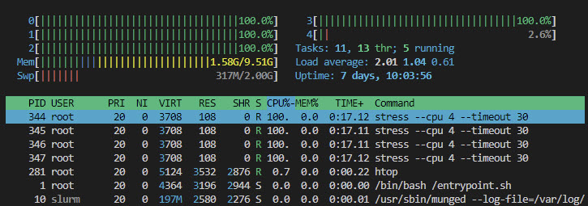
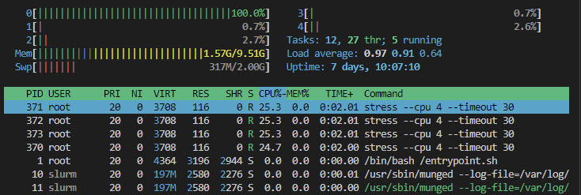

# Job Enforcement

By default, Slurm allocates resources like CPUs and memory based on job requests but does not strictly prevent a job from exceeding these limits. This means a job can potentially use more CPUs or memory than requested if the system allows it, which can impact other jobs on the same node.

To ensure strict enforcement, administrators must enable and configure Linux control groups (`cgroups`) via slurm.conf and cgroup.conf. This allows Slurm to constrain CPU usage through `cpusets` and enforce memory limits, terminating jobs that exceed their allocations.

To enable cgroups, we need to edit the `slurm.conf` and ensure the following line is present:

    TaskPlugin=task/cgroup

Create a file called `/etc/slurm/cgroup.conf` on all nodes (controller and compute), with content like this:

    ConstrainCores=yes
    ConstrainRAMSpace=yes
    ConstrainDevices=no

Let us go over an example on how cgroups works in practice on Slurm.

Open an interactive shell to compute1:

```bash
docker exec -it compute1 bash
```

Install `htop` and `stress` packages:

```bash
apt update && apt install htop stress -y
```

Invoke the stress test in the background that spawns 4 CPU workers:

```bash
stress --cpu 4 --timeout 30 &
```

Open `htop` to confirm four CPUs are busy:

```bash
htop
```



Open an interactive shell to the controller:

```bash
docker exec -it slurm-controller bash
```

And invoke the same stress test, but through Slurm:

```bash
sbatch --cpus-per-task=1 --wrap="stress --cpu 4 --timeout 30"
```

Slurm, with cgroup enforcement enabled, does the following:

- Allocates only 1 CPU core to the job.
- Creates a cpuset cgroup that limits which CPU(s) the job can use.
- Even though stress spawns 4 processes, the kernel scheduler ensures that only 1 core is allowed for execution.

So in htop, you'll still see 4 process, but only one will be consuming CPU.

The others will be throttled/stalled due to the cgroup constraint.


